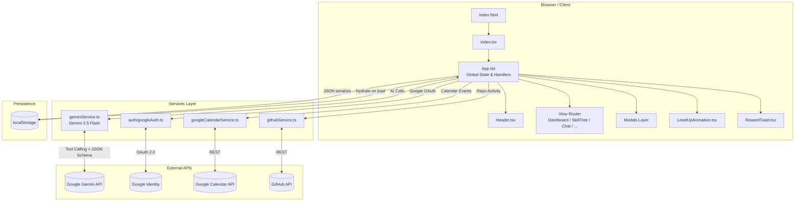
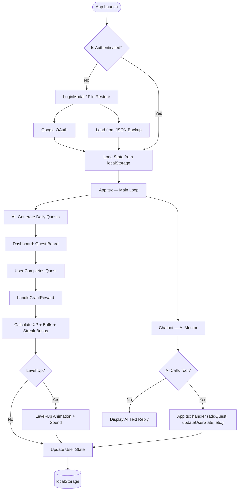
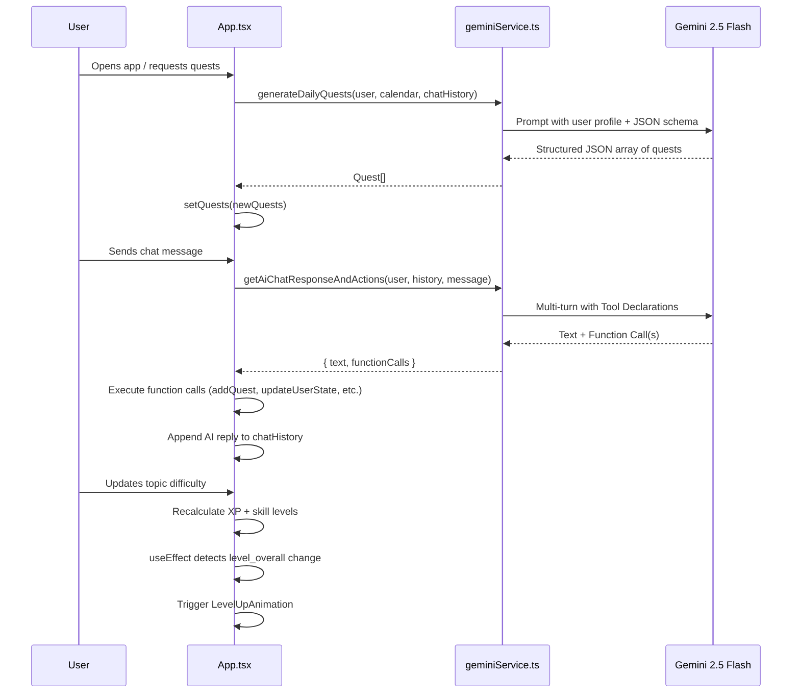
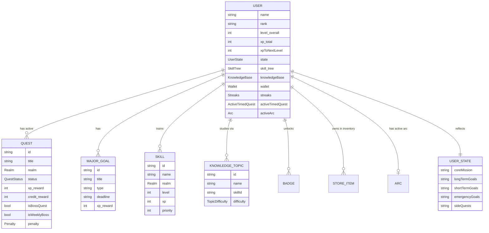
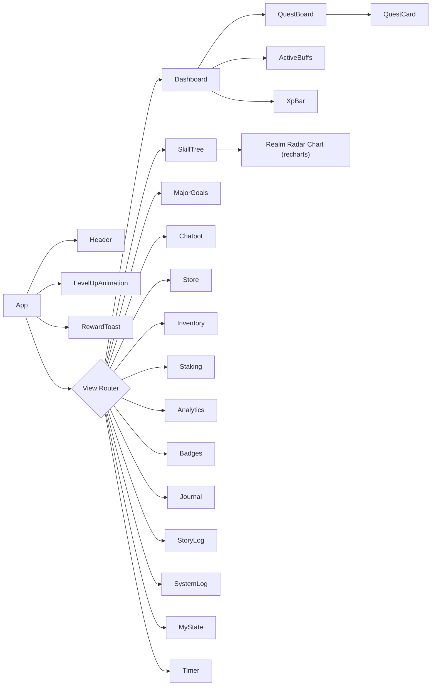

# 🎮 LevelUp: AI Awakening

> **Turn your real life into an RPG.** LevelUp is a gamified productivity system powered by Gemini AI that transforms your goals, skills, and daily habits into quests, XP, and character progression.

## 🌟 What is LevelUp?

LevelUp is a **free, open-source, browser-based productivity app** that treats your real life like an RPG video game. Set your goals, define your skills, and let an AI Mentor (powered by Google Gemini) generate personalized daily quests, track your streaks, reward you with XP and loot, and keep you accountable — all without any backend or data collection.

Everything runs **entirely in your browser**. Your data never leaves your device.

> [!NOTE]
> **You can try LevelUp without an API key.** The app fully works for manual quest creation, XP tracking, skill trees, badges, analytics, and all core RPG features. An API key is only needed to unlock AI-powered features like auto-generated quests and the AI Mentor chat.

> [!IMPORTANT]
> **We do not collect your API key or any personal data.** Your Gemini API key is stored only in your browser's `localStorage` on your own machine. It is never transmitted to us or any third-party server. We have zero capability to collect, view, or store your API key, progress data, or any personal information.

---

## 📖 Table of Contents

- [Features](#-features)
- [Tech Stack](#-tech-stack)
- [Architecture Overview](#-architecture-overview)
- [Directory Structure](#-directory-structure)
- [Application Flow](#-application-flow)
- [AI Integration Flow](#-ai-integration-flow)
- [Data Model](#-data-model)
- [Component Map](#-component-map)
- [Getting Started](#-getting-started)

---

## ✨ Features

| Feature | Description |
|---|---|
| 🧠 **AI Quest Generation** | Gemini AI generates personalized daily quests based on your skills, goals, and calendar events |
| 📈 **Skill Tree** | Track skills across 6 Realms: Mind, Body, Creation, Spirit, Social, Meta |
| 🗺️ **Major Goals** | Define long-term milestones (Exams, Projects, Gauntlets) with deadlines and XP rewards |
| 💬 **AI Mentor Chat** | Conversational AI that takes real-time actions (add quests, update goals, buy items) |
| 🎯 **My State** | Define your Core Mission, Long-Term, Short-Term, and Emergency Goals to guide the AI |
| 🔥 **Streak System** | Daily streak bonuses that scale XP and lootbox rewards |
| 🎁 **Daily Lootbox** | Randomized drops: Credits, XP, Gems, or consumable items |
| 🏆 **Badges & Achievements** | Unlockable badges for reaching milestones (Level 10, Boss Kills, Realm Mastery) |
| 🧵 **Story Arcs** | Thematic event overlays that modify gameplay (e.g., "Exam Week" arc boosts Study XP) |
| 🧾 **Journal & AAR** | After-Action-Review system that generates improvement quests from your reflections |
| 📊 **Analytics** | Visualize XP history, activity heatmaps, and skill radar charts |
| 💰 **Economy & Staking** | In-game credit economy with consumable buffs and a credit staking system |
| 🔌 **Integrations** | Google Calendar (quest prep), GitHub activity (code quests) |
| ⏱️ **Timed Quests** | Focus timer with time-bonus XP rewards for finishing early |
| 📦 **Backup & Restore** | Full JSON export/import of your entire save state |

---

## 🛠️ Tech Stack

| Layer | Technology |
|---|---|
| **Framework** | React 19 + TypeScript |
| **Build Tool** | Vite 6 |
| **Animations** | Framer Motion 12 |
| **Charts** | Recharts 3 |
| **Icons** | Lucide React |
| **AI Engine** | Google Gemini API (`@google/genai`) — Model: `gemini-2.5-flash` |
| **Auth** | Google OAuth 2.0 (via `auth/googleAuth.ts`) |
| **Integrations** | Google Calendar API, GitHub REST API |
| **Styling** | Vanilla CSS + Tailwind CSS utility classes |
| **Deployment** | Firebase Hosting |

---

## 🏗️ Architecture Overview



---

## 📁 Directory Structure

```
levelup/
├── App.tsx                   # Root component — all global state, handlers, and routing
├── index.tsx                 # React entry point
├── index.html                # HTML shell
├── types.ts                  # All TypeScript interfaces and enums
├── constants.ts              # Default data (badges, store items, initial user state)
│
├── auth/
│   └── googleAuth.ts         # Google OAuth 2.0 token management
│
├── services/
│   ├── geminiService.ts      # All Gemini AI calls (quests, chat, goals, topics...)
│   ├── googleCalendarService.ts  # Fetch upcoming events
│   ├── githubService.ts      # Fetch recent commit/PR activity
│   └── googleDriveService.ts # (Placeholder) Drive backup integration
│
└── components/
    ├── Dashboard.tsx         # Main quest board, XP overview, major goals
    ├── Header.tsx            # User profile, XP bar, navigation
    ├── Chatbot.tsx           # AI Mentor chat + Journal mode
    ├── SkillTree.tsx         # Skill grid + Realm Radar chart
    ├── MajorGoals.tsx        # List of long-term goal milestones
    ├── Analytics.tsx         # XP history, activity heatmap
    ├── Store.tsx             # Shop for consumable buffs
    ├── Inventory.tsx         # Owned items + activation
    ├── Staking.tsx           # Credit staking system
    ├── Journal.tsx           # Post-goal reflection and AAR
    ├── Badges.tsx            # Achievement gallery
    ├── StoryLog.tsx          # Story arc narrative log
    ├── SystemLog.tsx         # System event messages
    ├── MyState.tsx           # Core mission and goal editor
    ├── Timer.tsx             # Focus timer for timed quests
    ├── LevelUpAnimation.tsx  # Full-screen generative art level-up celebration
    ├── QuestCard.tsx         # Individual quest item card
    ├── QuestBoard.tsx        # Quest grid wrapper
    ├── XpBar.tsx             # Reusable XP progress bar
    ├── ActiveBuffs.tsx       # Display of active XP/Credit buffs
    ├── RewardToast.tsx       # Pop-up XP/credit gain notifications
    ├── SettingsModal.tsx     # App settings (theme, API key, backup)
    ├── TestingPanel.tsx      # Dev panel for simulating XP, time, errors
    └── [... Modal components for each entity type]
```

---

## 🔄 Application Flow



---

## 🤖 AI Integration Flow

All AI calls are handled in `services/geminiService.ts` and orchestrated from `App.tsx`.



---

## 📦 Data Model



---

## 🧩 Component Map



---

## 🚀 Getting Started

### Prerequisites

- Node.js 18+
- A [Google Gemini API Key](https://aistudio.google.com/app/apikey)
- (Optional) A Google Cloud project with Calendar API enabled for calendar sync

### Setup

```bash
# Clone the repository
git clone https://github.com/oniondas/levelup.git
cd levelup

# Install dependencies
npm install

# Start the development server
npm run dev
```

Open [http://localhost:5173](http://localhost:5173) in your browser.

On first launch, you will be prompted to:
1. **Sign in** with your Google account, or load from a backup file.
2. **Enter your Gemini API key** — or **skip this step entirely**.

### ⚡ Skipping the API Key

You can click **"Skip"** on the API key prompt and use LevelUp straight away. You will have full access to:
- Manual quest creation & completion
- XP, levels, and skill tree progression
- Badges, streaks, lootboxes & the in-game economy
- Analytics, journal, story log, and all other views

AI features (auto-generated quests, AI Mentor chat, AAR analysis) will be disabled until you add a key later via **Settings → API Key**.

> [!IMPORTANT]
> **Privacy guarantee:** We do not have any capability to collect your API key, your name, your progress, or any other data. Everything is stored locally in your browser only.

### Build for Production

```bash
npm run build
```

Outputs a static bundle to `/dist`. Deploy with Firebase Hosting or any static host.

---

## 🔐 Privacy

- Your Gemini API key is stored only in your browser's `localStorage`.
- All user progress data is persisted locally. No data is sent to any backend server.
- Google Calendar / GitHub integrations use OAuth tokens stored in memory only.

---

## 📜 License

This project is open source under the MIT License. See `LICENSE` for details.
