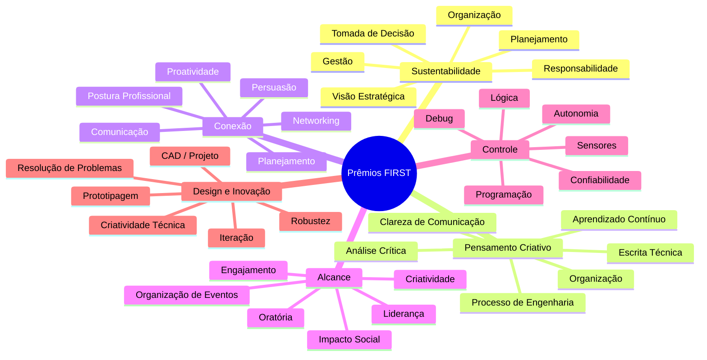

# BazManager — Bazinga! 73 FTC

> Plataforma completa de desenvolvimento de membros, gestão técnica, inventário e governança para a equipe de robótica **Bazinga! 73** (FIRST Tech Challenge), baseada na metodologia **B-LEED**.

[](https://vercel.com/new/clone?repository-url=https://github.com/Luccamm11/setup-bazmanager)
[](https://www.typescriptlang.org/)
[](https://react.dev/)
[](https://vitejs.dev/)
[](https://supabase.com/)
[](https://tailwindcss.com/)
[](https://ai.google.dev/)

---

## 📋 Sobre o Projeto

O **BazManager** é o sistema operacional e plataforma gamificada de gestão e desenvolvimento individual e coletivo da equipe de robótica **Bazinga! 73 FTC**. Cada membro possui uma jornada personalizada com competências, metas e missões configuradas de acordo com seu **prêmio foco FIRST** (Sustentabilidade, Pensamento Criativo, Conexão, Alcance, Controle, Design e Inovação).

Além do desenvolvimento humano e gamificado (metodologia **B-LEED**), a plataforma centraliza toda a infraestrutura operacional da equipe:
- **Gestão de Peças e Inventário de Robótica FTC** (REV Robotics, goBILDA, eletrônica, etc.)
- **Fila de Impressão 3D** para prototipagem e peças finais
- **Gestão de Mentores e Sessões de Mentoria Técnica**
- **Planejamento Tático com Matriz 5W2H e Quadro Kanban**
- **Controle Financeiro e Orçamentário da Temporada**
- **Trilhas de Aprendizagem e Capacitação Técnica**
- **Mentor IA Integrado via Google Gemini**

### Origem & Evolução

O projeto nasceu de uma adaptação do **LevelUp: AI Awakening** (criado por [Oniondas](https://github.com/Oniondas)) e foi amplamente expandido por [LuccaHP](https://github.com/LuccaHP) para se tornar um ecossistema completo para equipes da FIRST Tech Challenge.

---

## 🚀 Módulos e Funcionalidades

### 👤 Desenvolvimento Individual (Gamificação & B-LEED)
- **Dashboard do Membro:** Visão consolidada de nível, XP, créditos, metas de curto prazo e objetivos da temporada.
- **Árvore de Habilidades (Radar Chart):** Mapeamento dinâmico dos 6 atributos específicos de cada prêmio foco FIRST.
- **Quests & Missões:** Criação de quests personalizadas, missões manuais e geração inteligente com IA.
- **Major Goals:** Metas estratégicas de médio e longo prazo com prazos e acompanhamento de progresso.
- **Diário de Bordo & Reflexão:** Registro de aprendizados pós-missão para consolidação de conhecimento.
- **Mentor IA (Gemini):** Chat interativo com IA calibrada com a identidade e desafios da Bazinga! 73.
- **Timer de Foco (Pomodoro):** Cronômetro integrado para execução concentrada de quests e sessões de estudo.
- **Loja & Conquistas:** Resgate de recompensas, itens de suporte, buffs temporários e badges desbloqueáveis.

### 👥 Gestão de Equipe & Painel do Técnico
- **Tech Dashboard:** Visão unificada de todos os membros, missões pendentes e evolução geral.
- **Visão Geral de Competências (TechSkillOverview):** Comparativo de radares e competências de toda a equipe.
- **Atribuição de Missões da Equipe:** Criação e direcionamento de missões coletivas ou individuais com prazos e recompensas.

### 📦 Inventário de Robótica FTC
- **Catálogo Completo:** Controle detalhado de motores, servos, sensores, canais estruturais, fixadores, baterias, eletrônica REV/goBILDA e consumíveis.
- **Gestão de Estoque:** Localização física (gavetas/caixas), quantidades mínimas, status e categorização.
- **Histórico & Movimentações:** Rastreamento de uso de peças em subsistemas do robô.

### 🖨️ Fila de Impressão 3D
- **Requisições de Peças:** Cadastro de arquivos (STL/STEP/G-code), material (PLA, PETG, TPU, ABS/ASA), cor e camada.
- **Estimativas e Priorização:** Estimativa de tempo de impressão, peso em gramas, prioridade por subsistema e status (Na Fila, Imprimindo, Concluído, Falha).

### 🤝 Gestão de Mentores & Sessões
- **Cadastro de Especialistas:** Registro de mentores internos, ex-alunos, profissionais da indústria e parceiros acadêmicos.
- **Atas e Registros de Mentoria:** Documentação de feedbacks, pontos de ação, dúvidas resolvidas e conexões geradas.

### 📋 Planejamento Ágil (Kanban & 5W2H)
- **Quadro Kanban:** Gestão visual de tarefas por status (*Backlog, A Fazer, Em Andamento, Concluído*) com tags por área técnica.
- **Planos de Ação 5W2H:** Estruturação formal (*What, Why, Where, When, Who, How, How Much*) para projetos estratégicos.

### 💰 Gestão Financeira & Orçamento
- **Fluxo de Caixa:** Lançamento de receitas (patrocínios, eventos, rifas) e despesas (inscrições, peças, logística).
- **Relatórios & Gráficos:** Acompanhamento de orçamento por categoria em conformidade com o Prêmio de Sustentabilidade.

### 📚 Trilhas de Aprendizagem B-LEED
- **Cursos e Módulos:** Trilhas formativas estruturadas para calouros e veteranos (Programação Java/FTC, CAD Onshape, Gestão, Oratória).
- **Progresso Modular:** Acompanhamento de módulos concluídos e avaliações práticas.

---

## 🏗️ Arquitetura do Projeto

```
setup-bazmanager/
├── api/                       # Vercel Serverless Functions
│   ├── _lib/                  # Utilitários compartilhados de backend (Supabase / Auth)
│   ├── login.ts               # Autenticação de membros e técnicos
│   ├── persistence.ts         # Leitura e gravação de estado do membro (key_value_store)
│   ├── crud.ts                # Operações CRUD centralizadas e Backup Cron
│   ├── team-missions.ts       # Gestão de missões da equipe
│   ├── 5w2h.ts                # Endpoints da matriz 5W2H
│   ├── forms.ts               # Formulários e registros de presença
│   ├── generate-journey.ts    # Geração de jornadas via IA
│   ├── members.ts             # Gestão de membros
│   ├── mentors.ts             # Cadastro e histórico de mentorias
│   ├── notifications.ts       # Sistema de notificações
│   ├── printer-queue.ts       # Fila de impressão 3D
│   └── projects.ts            # Gestão de projetos da equipe
├── data/                      # Dados e perfis base
│   ├── members.ts             # Cadastro central de membros e técnicos
│   ├── awardProfiles.ts       # Definições de competências por prêmio FIRST
│   └── initialData.ts         # Factory de inicialização de novo membro
├── components/                # Componentes React
│   ├── RoboticsInventory.tsx  # Gestão de inventário e peças FTC
│   ├── PrinterQueue.tsx       # Fila de impressão 3D
│   ├── MentorManagement.tsx   # Gestão de mentores e atas
│   ├── FinanceDashboard.tsx   # Painel financeiro e fluxo de caixa
│   ├── KanbanBoard.tsx        # Quadro Kanban ágil
│   ├── FiveW2H/               # Módulo de planos 5W2H
│   ├── LearningTrails/        # Módulo de Trilhas de Aprendizagem
│   ├── BProjects/             # Módulo de Projetos da Equipe
│   ├── Chat/                  # Chat interno da equipe
│   ├── DashboardTab.tsx       # Dashboard principal
│   ├── SkillTree.tsx          # Árvore de habilidades com radar
│   ├── TechDashboard.tsx      # Painel do técnico
│   ├── TechSkillOverview.tsx  # Comparativo de competências
│   ├── TestingPanel.tsx       # Painel de testes e simulação
│   └── ...                    # Modais, timers, inventário e utilitários de UI
├── locales/                   # Suporte a Internacionalização (i18n)
│   ├── en/                    # Traduções em Inglês
│   └── pt-BR/                 # Traduções em Português (Padrão)
├── services/                  # Integrações externas (Gemini AI)
├── types.ts                   # Definições de tipos TypeScript
├── constants.ts               # Constantes e configurações globais
├── App.tsx                    # Componente raiz da aplicação
└── index.html                 # Entry point HTML
```

---

## 👥 Membros da Equipe & Atuação

| Membro | Prêmio Foco | Área Principal |
|--------|-------------|----------------|
| **Lucca** | 🌱 Sustentabilidade | Planejamento, organização, gestão financeira e liderança |
| **Clarice** | 💡 Pensamento Criativo (AE) | Documentação de engenharia, Engineering Portfolio |
| **Ana Clara** | 💡 Pensamento Criativo (MCI) | Documentação técnica detalhada, análise crítica |
| **Bernardo** | 🤝 Conexão | Parcerias institucionais, networking, captação |
| **Sara Galdino** | 🤝 Conexão | Relações com mentores, eventos e parcerias estratégicas |
| **Enzo Soares** | 🤖 Controle | Programação FTC (Java/OnBot), sensores e autônomo |
| **Pedro** | 🤖 Controle | Arquitetura de software, automação e teleoperado |
| **Yan** | 💡 Inovação | CAD, projeto mecânico, prototipagem e mecanismos |
| **Guilherme** | 🔧 Design | Arquitetura mecânica, modularidade e sistemas de elevação |
| **Enzo Resende** | 🔧 Design | Modelagem 3D, prototipagem e fabricação mecânica |

### Técnicos & Mentores
| Nome | Função |
|------|--------|
| **Jonas Lemos** | Orientador técnico, pedagógico e liderança B-LEED |
| **Ramon Montorri** | Orientador técnico e estratégico |

---

## 🏆 Prêmios FIRST e Atributos B-LEED

Cada membro desenvolve **6 atributos centrais** específicos de sua trilha:


```mermaid
mindmap
  root((Prêmios FIRST))
    Sustentabilidade
      Planejamento
      Gestão
      Responsabilidade
      Visão Estratégica
      Organização
      Tomada de Decisão
    Pensamento Criativo
      Organização
      Escrita Técnica
      Análise Crítica
      Processo de Engenharia
      Clareza de Comunicação
      Aprendizado Contínuo
    Conexão
      Comunicação
      Networking
      Postura Profissional
      Planejamento
      Persuasão
      Proatividade
    Alcance
      Oratória
      Liderança
      Criatividade
      Engajamento
      Organização de Eventos
      Impacto Social
    Controle
      Programação
      Lógica
      Sensores
      Autonomia
      Debug
      Confiabilidade
    Design e Inovação
      Criatividade Técnica
      CAD / Projeto
      Prototipagem
      Resolução de Problemas
      Robustez
      Iteração
```

---

## ⚙️ Stack Tecnológica

| Camada | Tecnologia |
|--------|------------|
| **Frontend** | React 19, TypeScript 5.8, Vite 6, Tailwind CSS |
| **UI & Visualização** | Framer Motion, Lucide React, Recharts |
| **Internacionalização** | i18next (PT-BR / EN) |
| **Backend & Serverless** | Vercel Serverless Functions (Node.js/TypeScript) |
| **Banco de Dados** | Supabase (PostgreSQL) com tabela `key_value_store` JSONB |
| **Inteligência Artificial** | Google Gemini AI (`@google/genai`) |
| **Automação de Backup** | Vercel Cron + GitHub REST API (JSON versionado) |

---

## 🗄️ Modelo de Dados & Persistência

O sistema utiliza o **Supabase (PostgreSQL)** como fonte primária de verdade.

### Tabela `key_value_store`
```sql
CREATE TABLE IF NOT EXISTS key_value_store (
  key TEXT PRIMARY KEY,
  value JSONB NOT NULL,
  updated_at TIMESTAMPTZ DEFAULT NOW()
);
```

### Taxonomia de Chaves
- `levelup_user_{username}`: Perfil completo, atributos, XP, inventário e progresso do membro.
- `levelup_notifications_{username}`: Notificações específicas do membro.
- `levelup_members_registry`: Cadastro centralizado de membros.
- `levelup_team_missions`: Missões de equipe.
- `levelup_5w2h_plans`: Planos de ação 5W2H.
- `levelup_printer_queue`: Solicitações e status da fila 3D.
- `levelup_robotics_inventory`: Catálogo e estoque de peças de robótica FTC.
- `levelup_mentors`: Cadastro de mentores e contatos.
- `levelup_mentorship_records`: Histórico e atas de mentorias.
- `levelup_attendance_records`: Frequência e presença dos membros.
- `levelup_finance_records`: Registros e fluxo de caixa financeiro.
- `levelup_kanban_tasks`: Tarefas do quadro ágil Kanban.
- `levelup_learning_trails_data`: Módulos e progresso das trilhas B-LEED.
- `levelup_chat_data`: Mensagens e histórico do chat da equipe.

---

## 🛡️ Backup Diário Automatizado

- **Execução:** Diariamente às 06:00 UTC via Vercel Cron (`/api/crud?action=backup`).
- **Origem:** Tabela `key_value_store` do Supabase.
- **Destino:** Repositório GitHub em `backups/backup-YYYY-MM-DD.json`.
- **Segurança:** Autenticação Bearer obrigatória (`CRON_SECRET`) e integridade via hash SHA-256.

---

## 🔑 Variáveis de Ambiente

Configure as seguintes variáveis no arquivo `.env.local` (desenvolvimento) e nas configurações da Vercel (produção):

| Variável | Obrigatória | Descrição |
|----------|-------------|-----------|
| `SUPABASE_URL` | Sim | URL base do projeto Supabase (`https://xxxx.supabase.co`) |
| `SUPABASE_SERVICE_ROLE_KEY` | Sim | Service Role Secret para leitura/escrita na `key_value_store` |
| `USE_SUPABASE` | Sim | Flag indicativa de persistência ativa no Supabase (`true`) |
| `CRON_SECRET` | Sim | Token secreto de autenticação Bearer para o Cron Job de backup |
| `GITHUB_BACKUP_TOKEN` | Sim | GitHub Personal Access Token (Fine-grained com permissão de escrita) |
| `GITHUB_BACKUP_REPO` | Sim | Repositório alvo dos backups (ex: `LuccaHP/Bazinga-LevelUp`) |
| `VITE_GEMINI_API_KEY` | Sim | Chave de API Google Gemini para o Mentor IA e geração de quests |

---

## 🚀 Como Rodar Localmente

### Pré-requisitos
- **Node.js** (v18+)
- **npm** ou **yarn**
- Instância ativa do Supabase

### Passo a Passo

```bash
# 1. Clonar o repositório
git clone https://github.com/Luccamm11/setup-bazmanager.git
cd setup-bazmanager

# 2. Instalar dependências
npm install

# 3. Criar arquivo de variáveis de ambiente
cp .env.example .env.local
# (Preencha as chaves SUPABASE_URL, SUPABASE_SERVICE_ROLE_KEY, USE_SUPABASE, VITE_GEMINI_API_KEY)

# 4. Iniciar servidor de desenvolvimento
npm run dev
```

Acesse em: `http://localhost:5173`

---

## 📄 Licença & Créditos

- **Base Original:** [LevelUp: AI Awakening](https://github.com/Oniondas) por **Oniondas**
- **Desenvolvimento & Arquitetura BazManager:** [LuccaHP](https://github.com/LuccaHP)
- **Equipe:** **Bazinga! 73** — FIRST Tech Challenge (SESI Robótica)
